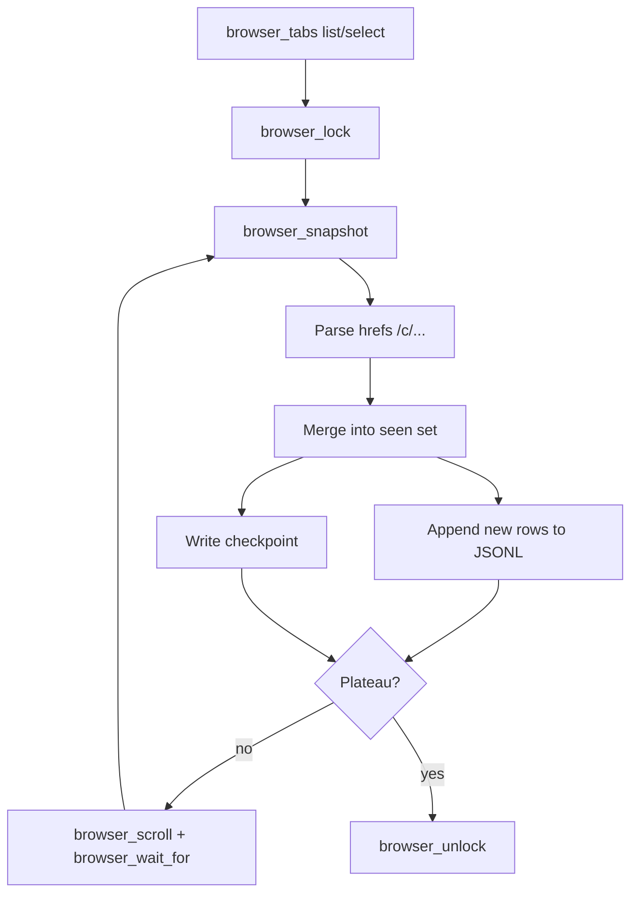

# Archived ChatGPT chats — Cursor Browser MCP loop

This describes a **Cursor `cursor-ide-browser` MCP–only** harvest loop for listing conversation links (paths like `/c/<id>`). It is meant to be executed by an agent inside Cursor using MCP tools, **not** by running `scrape_chatgpt_archived.py` (Playwright/Selenium-style scripts are a separate path).

## Tools (server: `cursor-ide-browser`)

| Step | Tool | Notes |
|------|------|--------|
| Pick tab | `browser_tabs` | `action: "list"` then `action: "select"` with `index` if needed |
| Lock | `browser_lock` | After the tab exists and is correct; optional `viewId` from tab list |
| Loop body | `browser_snapshot` | Use refs from snapshot for targeted `browser_scroll` if needed |
| Advance list | `browser_scroll` | e.g. `direction: "down"`, `amount: 600`–`1200`, or `ref` + `scrollIntoView: true` |
| Pace loading | `browser_wait_for` | `time` is **seconds** (e.g. `1`–`3`); optional `text` / `timeout` (ms) |
| Unlock | `browser_unlock` | Call when **all** MCP browser work for this session is done |

**Order:** `browser_navigate` (if opening the page) → `browser_tabs` → `browser_lock` → loop → `browser_unlock`. Do not lock before a tab exists.

## Control flow



## Parsing `/c/` links from a snapshot

Snapshots are **text** (accessibility tree with element refs). Extraction is done by the agent (regex or small script), not by a repo scraper:

1. Collect every substring that looks like a chat path:
   - `https://chatgpt.com/c/<uuid>`
   - `https://chat.openai.com/c/<uuid>`
   - Relative paths `/c/<uuid>` (normalize to absolute using the tab’s current origin from `browser_tabs` list output if available).
2. **UUID** pattern (typical ChatGPT id): `[0-9a-f]{8}-[0-9a-f]{4}-[0-9a-f]{4}-[0-9a-f]{4}-[0-9a-f]{12}` (case-insensitive).
3. **Deduplicate** with a set keyed by canonical URL or by `id` only.

If links appear only inside buttons/rows, they are still plain text in the snapshot; if the UI exposes no href in the tree, use `browser_get_attribute` on the link/button `ref` for `href` (read that tool’s schema under `mcps/cursor-ide-browser/tools/` before calling).

## JSONL append format

One JSON object per line (append-only). Suggested fields:

```json
{"id":"<uuid>","url":"https://chatgpt.com/c/<uuid>","title":null,"source_tab_url":"<page you were on>","captured_at":"<ISO-8601>"}
```

- Append **only** rows for ids not already in the in-memory `seen` set (and optionally not already present in the JSONL file if resuming).
- `title` can be filled from nearby snapshot text on the same row if obvious; otherwise `null`.

## Checkpoint file

Separate small file (e.g. `archived_chats_cursor.checkpoint.json`) the agent rewrites each iteration:

```json
{
  "page_url": "https://chatgpt.com/...",
  "seen_ids": ["..."],
  "last_iteration": 42,
  "updated_at": "2026-03-28T12:00:00Z"
}

```

On resume: load `seen_ids`, skip writing duplicates, continue scrolling from the same tab.

## Plateau detection (stop scrolling)

Stop the loop when the list **stops yielding new `/c/` ids** after scroll + wait:

1. After each snapshot, compute `new_count =` number of ids added to `seen` this iteration.
2. Increment a counter `streak` when `new_count == 0`, else reset `streak` to `0`.
3. **Plateau** when `streak >= P` (e.g. `P = 3`) **or** after `max_iterations` (safety cap).

Between iterations prefer short waits: `browser_wait_for` with `time: 1`–`3`, then snapshot again (per MCP guidance: incremental waits beat one long sleep).

## Operational notes

- Pass the same **`viewId`** to lock, snapshot, scroll, wait, and unlock if you use explicit tab targeting (see each tool’s `viewId` in `mcps/cursor-ide-browser/tools/*.json`).
- **iframes** are not visible to these tools; if the list lives in an iframe, this MCP path may not work—use the non-MCP scraper or a different page.
- For long pages, combine **page** `browser_scroll` (`direction: "down"`, `amount` tuned) with **container** scrolling if the snapshot shows a scrollable subtree (use `ref` from snapshot).

## Explicit non-goal

Do **not** invoke `scrape_chatgpt_archived.py` as part of this Cursor MCP workflow; keep MCP steps self-contained as above.
